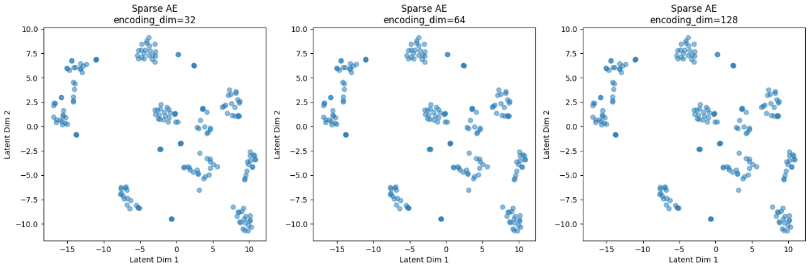
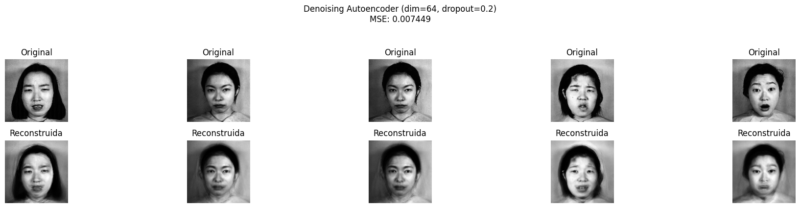
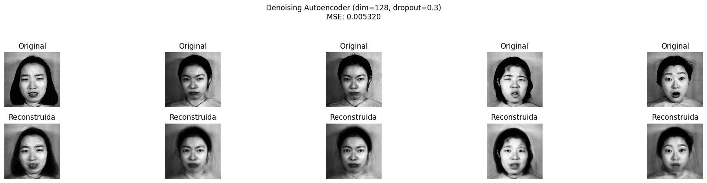
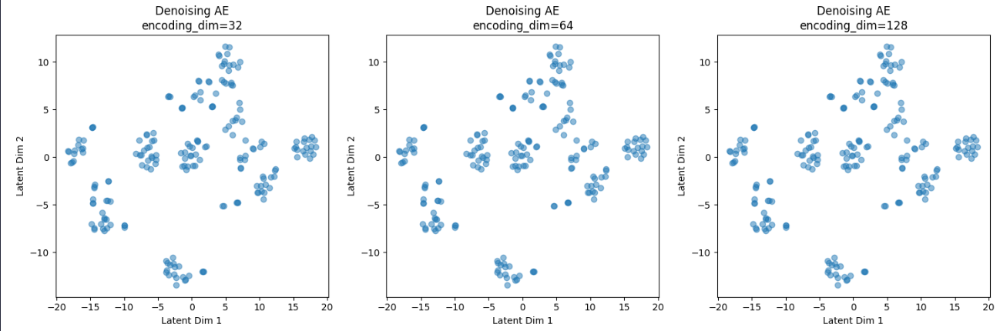
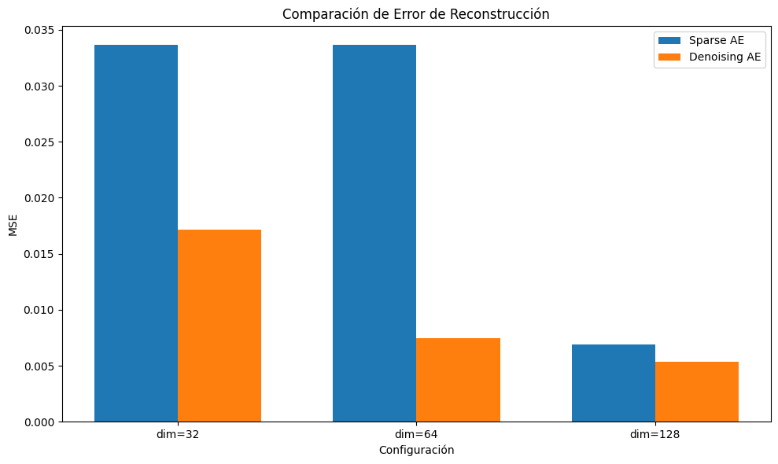

# 1. Análisis del Dataset
El dataset cuanta con una carpeta de entrenamienton de 200 imagenes y una carpeta de prueba con 12 imagenes. Las imagenes tratan de emociones expresadas por distintas personas y los nombres de las imagenes siguen el siguiente formato: NombrePersona.EmocionNumero.Numero.jpg}

*La Imagen KA.AN1.39 muestra al sujeto KA con la emocion AN, angry*

Haciendo un análisis del dataset se obtiene las siguientes frecuencias de emociones

# Implementación de Autoencoders
## Sparse
### Parámetros

| No. | Dim | Sparsity |
|-----|-----|----------|
| 1   | 32  | 1e-5     |
| 2   | 64  | 1e-6     |
| 3   | 128 | 1e-7     |

Épocas: 100
Batch_size: 16
Validation_split: 0.2

### Gráfica loss

### Reconstrucción de las imágenes

### TSNE para visualización del espacio latente en el conjunto de entrenamiento

## Denoising
### Parámetros

| No. | Dim | Noise   |
|-----|-----|---------|
| 1   | 32  | 0.1     |
| 2   | 64  | 0.2     |
| 3   | 128 | 0.3     |

Épocas: 100
Batch_size: 16
Validation_split: 0.2

### Gráfica loss

### Reconstrucción de las imágenes

### TSNE para visualización del espacio latente en el conjunto de entrenamiento

# Comparación de los autoencoders
## Proceso de Clasificación

1. Etapa de Codificación: Pasar cada imagen a través de la parte del codificador del autoencoder. Esto genera una representación en el espacio latente (un vector de características comprimido y significativo) para cada imagen.

2. Guardar Representaciones Latentes: Recopilar y almacenar estas representaciones latentes, ya que sirven como el conjunto de características para el modelo de clasificación.

3. Modelo de Clasificación: Entrenar un algoritmo de clasificación (por ejemplo, SVM, regresión logística o una red neuronal) utilizando las representaciones del espacio latente como entrada y las etiquetas correspondientes como objetivo.

4. Evaluación: Probar el rendimiento del clasificador en un conjunto de validación o prueba para asegurar la calidad del espacio latente generado por el autoencoder.

## Comparación del error de reconstrucción

## Evaluación con SVM

## Resultados para todas las configuraciones

| Tipo de modelo | Dimensión de codificación | Parámetro adicional               | Accuracy |
|----------------|---------------------------|-----------------------------------|----------|
| Sparse         | 32                        | Regularización de sparsity: 1e-05 | 0.0000   |
| Denoising      | 32                        | Tasa de dropout: 0.1              | 0.2500   |
| Sparse         | 64                        | Regularización de sparsity: 1e-06 | 0.0000   |
| Denoising      | 64                        | Tasa de dropout: 0.2              | 0.0833   |
| Sparse         | 128                       | Regularización de sparsity: 1e-07 | 0.0833   |
| Denoising      | 128                       | Tasa de dropout: 0.3              | 0.3333   |

## Evaluación con Naive Bayes

| Tipo de modelo | Dimensión de codificación | Parámetro adicional               | Accuracy |
|----------------|---------------------------|-----------------------------------|----------|
| Sparse         | 32                        | Regularización de sparsity: 1e-05 | 0.4167   |
| Denoising      | 32                        | Tasa de dropout: 0.1              | 0.0833   |
| Sparse         | 64                        | Regularización de sparsity: 1e-06 | 0.4167   |
| Denoising      | 64                        | Tasa de dropout: 0.2              | 0.0833   |
| Sparse         | 128                       | Regularización de sparsity: 1e-07 | 0.0833   |
| Denoising      | 128                       | Tasa de dropout: 0.3              | 0.0833   |

